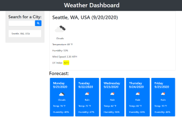

# Weather Dashboard

Weather Dashboard is a custom weather dashboard that displays basic weather data for any location. Once the user enters an address or city, Weather Dashboard displays the current weather for that location, as well has a 5 day forecast. It displays the UV index highlighted in color to give quick at-a-glance information about UV intensity.

Weather Dashboard relies on several server-side APIs for its functionality. The weather data that is presented to the user is gathered from OpenWeatherMap's OneCall API. Since the OneCall API requires the application to pass latitude and longitude coordinates to receive the weather data, GeoCodeAPI is used to return coordinates based on the user input. In addition, GeoCodeAPI's autofill API is used to supply autofill suggestions of locations as the user types. The autofill dropdown menu is built using only Vanilla JavaScript. 

The user's past entries are stored persistantly and displayed underneath the input field. This data is used to display the user's most recently entered location, and weather data for past entries can be easily loaded by clicking on the entry.

Weather Dashboard is deployed at https://elijah415hz.github.io/06-weather-dashboard/
